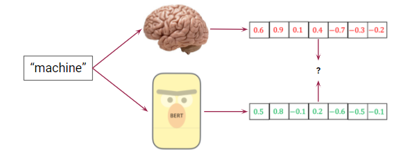

## 566-bert-project : Are Multi-Layer BERT Features and EEG Data Correlated?


### Table of Contents

- [Description](#description)
- [How To Use](#how-to-use)


## Description
Machine Learning applied to natural language understanding has performed impressively in modern times. Two popular architectures for Natural Language Processing (NLP) tasks are Recurrent Neural Network (RNN)-based models and Transformer-based models. Recent Transformer architectures like BERT  and RoBERTa have been shown to outperform some of the best recurrent models in natural language tasks.In an attempt to better understand language models, we have created this repository.

## How To Use

#### Installation

* Install required packages using `pip install -r requirements.txt`
* Run the main.py : `python main.py`

### Experiments

* To enable the sliding window in the codebase, change the value of Boolean variable to True 
```html
ENABLE_SLIDING_WINDOW = False
```
* To enable the BERT layer concatenation in the codebase, change the value of ENABLE_BERT_LAYER_CONCAT variable to True 
```html
ENABLE_BERT_LAYER_CONCAT = False
```
* To enable the dimensionality reduction in the codebase, change the value of ENABLE_DIM_RED variable to True
```html
ENABLE_DIM_RED = False
```
* To enable the statistical test in the code in the codebase, change the value of ENABLE_STATISTICAL_TEST variable to True
```html
ENABLE_STATISTICAL_TEST = False
``` 

[Back To The Top](#566-bert-project )


