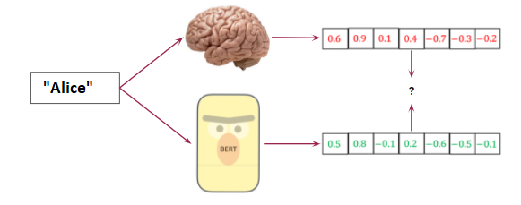

## 566-bert-project : Are Multi-Layer BERT Features and EEG Data Correlated?


### Table of Contents

- [Description](#description)
- [How To Use](#how-to-use)
- [Code Details](#code-details)


## Description
Literature in NLP suggests that we can get better NLP task results by using features from multiple layers ([Devlin et al., 2019](https://www.aclweb.org/anthology/N19-1423/)), and we know that alignment of models with brain data leads to an increased performance on tasks ([Hollenstein et al., 2019a](https://arxiv.org/abs/1904.02682); [Toneva and Wehbe, 2019](https://arxiv.org/abs/1905.11833)), we hypothesise that the multi-layer features are more correlated with the brain data than single layer features. If we know which multi-layer features are most cor- related with brain data, then we can use them for getting improved results on NLP tasks. 

With the progress seen in NLP by using the recent BERT model, and the improvement in performance seen by applying brain data to models ([Hollenstein et al., 2020](https://www.aclweb.org/anthology/2020.lincr-1.3/)), we feel encouraged to pursue this problem of exploring correlations between BERT representations and brain activity for semantically and/or syntactically incorrect data.

We test this hypothesis empirically in our project.

For more details, please check the [video](https://www.youtube.com/watch?v=zb4UGBLtmpo) uploaded. 

## How To Use

#### Installation

* Install required packages using `pip install -r requirements.txt`
* Run the main.py : `python main.py`

### Experiments

* To enable the sliding window in the codebase, change the value of Boolean variable to True 
```html
ENABLE_SLIDING_WINDOW = False
```
* To enable the BERT layer concatenation in the codebase, change the value of ENABLE_BERT_LAYER_CONCAT variable to True 
```html
ENABLE_BERT_LAYER_CONCAT = False
```
* To enable the dimensionality reduction in the codebase, change the value of ENABLE_DIM_RED variable to True
```html
ENABLE_DIM_RED = False
```
* To enable the statistical test in the code in the codebase, change the value of ENABLE_STATISTICAL_TEST variable to True
```html
ENABLE_STATISTICAL_TEST = False
``` 

## Code Details


[Back To The Top](#566-bert-project )


